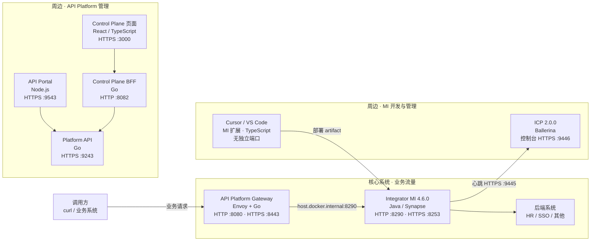

# ESB 本地架构

说明本机已经跑通的两套产品怎么分工：**核心系统**处理业务请求，**周边管理系统**负责开发、发布和查看状态。端口和语言按当前本地部署写，不是生产规格。

相关操作步骤见 [api-platform-startup.md](./api-platform-startup.md)、[product-integrator-mi-startup.md](./product-integrator-mi-startup.md)、[product-integrator-mi-tooling.md](./product-integrator-mi-tooling.md)、[gateway-mi-hello.md](./gateway-mi-hello.md)。

## 1. 先看这一张图

业务请求从左到右，只经过网关和 MI。管理端在旁边，不在这条链上。



管理 API 不画进业务箭头里，避免和流量混在一起：

| 谁 | 端口 | 干什么 |
|---|---:|---|
| Gateway Controller | 9090 | 注册 RestAPI、发 API Key（Basic Auth） |
| Gateway 健康检查 | 9094 | 看网关是否起来 |
| MI Management API | 9164 | 运行时管理接口（HTTPS，自签） |

## 2. 核心系统

核心系统只有两段：**网关**对外，**MI** 对内做集成。调用方不直接打后端。

### 2.1 API Platform Gateway

数据面。负责鉴权、路由、策略，然后把请求转到上游。

| 部分 | 语言 | 本机端口 | 作用 |
|---|---|---:|---|
| Router | Envoy（C++） | 8080 HTTP、8443 HTTPS | 业务入口 |
| Gateway Controller | Go | 9090 管理 API、9094 健康检查 | 接收 API 定义，通过 xDS（内部 18000）下发给 Envoy |
| Policy Engine | Go | 内部 9002 | 执行 API Key 等策略 |
| 示例 echo | — | 15000 | 网关自带后端，用来验证网关本身 |

网关跑在 Docker 里。转到本机 MI 时，上游地址写成 `http://host.docker.internal:8290`，因为容器里的 `localhost` 不是宿主机。

已验证的路径：

```text
curl :8080/mi/HelloWorld → Gateway → host.docker.internal:8290 → MI HelloWorld
```

**Envoy（C++）** 是这个网关里真正接流量的进程。它是一个用 C++ 写的代理，按配置转发 HTTP / gRPC，自己不存 API 目录，也没有登录页。

| 角色 | 谁 |
|---|---|
| 接 `8080` / `8443` | Envoy（Router） |
| 把「路径转到哪、要不要验 API Key」推给 Envoy | Gateway Controller（Go），经内部 xDS `18000` |
| 执行 API Key 等策略 | Policy Engine（Go） |

业务请求是：调用方 → Envoy → MI `8290` → 后端。不改 Envoy 源码，用官方镜像。

### 2.2 Integrator MI

集成运行时。负责编排：调多个系统、映射字段、拼响应。试点里的 HR 同步、SSO 待办聚合都写在这里。

| 项 | 值 |
|---|---|
| 版本 | 4.6.0 发行包（不编译源码） |
| 语言 | Java（Synapse 配置；开发时用图形扩展生成 XML） |
| 业务 HTTP | 8290 |
| 业务 HTTPS | 8253 |
| Management API | 9164 |
| 安装位置 | `/Users/mengfd/workspace/esb/runtimes/wso2mi-4.6.0` |

MI **没有**网页管理控制台。`curl http://localhost:8290/HelloWorld` 打的是运行时，不是控制台。

## 3. 周边管理系统

周边系统不转发业务流量。可以全部停掉，核心链路仍然能 `curl`。

### 3.1 API Platform 这一侧

给「对外发布的 API」用：谁能看目录、谁能登录管理台。和网关上已经注册的 RestAPI **不是同一份数据**。门户是空的，不代表网关没通。

| 组件 | 语言 | 端口 | 作用 |
|---|---|---:|---|
| API Portal | Node.js | 9543 HTTPS | 开发者门户。地址：`https://localhost:9543/api-portal/default/views/default` |
| Platform API | Go | 9243 HTTPS | 门户和控制台共用的后端（登录、令牌、目录数据） |
| Control Plane 页面 | React / TypeScript | 3000 HTTPS | 管理控制台页面 |
| Control Plane BFF | Go | 8082 HTTP | 页面和 Platform API 之间的代理，管登录态 |

启动关系：先起 Portal 的 compose（会带上 Platform API），再起 BFF 和页面。界面目前只有英文。

### 3.2 MI 这一侧

给「写集成、看运行时」用。

| 组件 | 语言 | 端口 | 作用 |
|---|---|---:|---|
| MI for VS Code / Cursor | TypeScript（扩展） | 无 | 画流程、建工程、部署到本机 MI。扩展里的 Default Profile 是 Ballerina，试点选 MI Profile |
| ICP | Ballerina | 9446 控制台、9445 心跳 | 网页上看 MI 是否在线。MI 用 `icp_config` 连 9445 |

**Ballerina** 是 WSO2 的一门集成语言，用来直接描述 HTTP 调用和 JSON 组装，运行时是 Ballerina 发行包，不是 Java 上的 Synapse。本机只在周边出现，不在业务主路径上：

| 出现位置 | 做什么 |
|---|---|
| ICP 2.0.0 | 控制台服务端用 Ballerina 写的。只运行 `icp.sh`，不写 Ballerina |
| 扩展的 Default Profile | 「WSO2 Integrator: Default」要求安装 Ballerina 发行包 |

试点用的是 **MI Profile**：Java 运行时 + Synapse XML。扩展里的 `Ballerina Distribution Not Found` 可以忽略，把 Profile 改成 MI。

## 4. 端口总表

本机监听，按「谁对外」分组。

### 业务

| 端口 | 协议 | 组件 | 用途 |
|---:|---|---|---|
| 8080 | HTTP | Gateway | 业务入口 |
| 8443 | HTTPS | Gateway | 业务入口（HTTPS） |
| 8290 | HTTP | MI | 集成运行时入口 |
| 8253 | HTTPS | MI | 集成运行时入口（HTTPS） |

### 核心系统的管理接口

| 端口 | 协议 | 组件 | 用途 |
|---:|---|---|---|
| 9090 | HTTP | Gateway Controller | 注册 API、发 Key |
| 9094 | HTTP | Gateway | 健康检查 |
| 9164 | HTTPS | MI | Management API |

### 周边

| 端口 | 协议 | 组件 | 用途 |
|---:|---|---|---|
| 9543 | HTTPS | API Portal | 开发者门户 |
| 9243 | HTTPS | Platform API | 门户 / 控制台后端 |
| 3000 | HTTPS | Control Plane UI | 管理页面 |
| 8082 | HTTP | Control Plane BFF | 页面后端代理 |
| 9446 | HTTPS | ICP | 控制台 |
| 9445 | HTTPS | ICP | MI 心跳 |

容器内部端口（xDS 18000、Policy Engine 9002、Envoy admin 9901）只在网关 compose 网络里用，本机一般不直接访问。

## 5. 语言总表

| 系统 | 主要语言 | 你要不要写这种语言 |
|---|---|---|
| Gateway Router | Envoy（C++） | 不用，用镜像 |
| Gateway Controller / Policy Engine | Go | 不用，用镜像 |
| Platform API、Control Plane BFF | Go | 本地起控制台时要有 Go 工具链；不改产品源码 |
| API Portal | Node.js | 用镜像即可 |
| Control Plane 页面 | React / TypeScript | 本地 `npm run dev` 需要 Node 24 |
| MI 运行时 | Java | 要有 JDK 21 才能启动 |
| MI 集成逻辑 | Synapse XML（扩展生成） | 试点主要写这个 |
| MI 扩展 | TypeScript | 只安装使用 |
| ICP | Ballerina | 用发行包，不写 Ballerina |
| Ballerina Default Profile | Ballerina | 当前不用 |

## 6. 和试点的关系

| 场景 | 落在哪 |
|---|---|
| 对外统一入口、API Key、路由 | Gateway :8080 |
| HR 主数据同步、待办数聚合 | MI :8290 里的集成 |
| 给人看的 API 目录 | API Portal :9543（要单独发布，不会自动出现网关上的 API） |
| 画 MI 流程 | Cursor MI 扩展 |
| 看 MI 是否在跑 | ICP :9446 |

建议学习顺序：先 Gateway → MI 这一条业务链，再 MI 扩展改一个流程。Portal、Control Plane、ICP、Ballerina 都是周边，可以后补。
